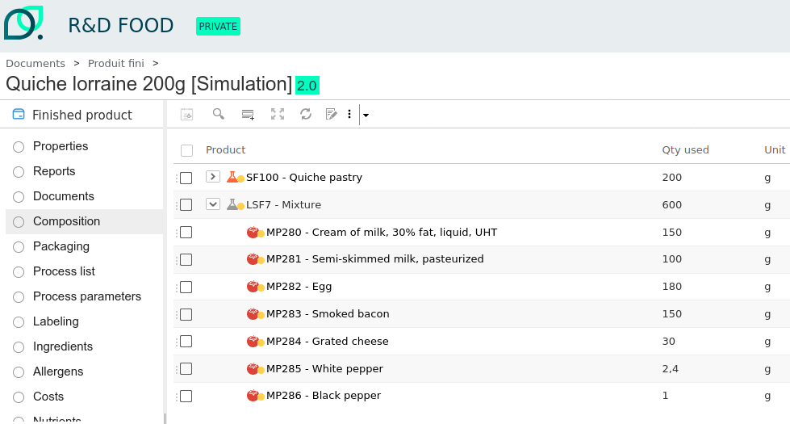
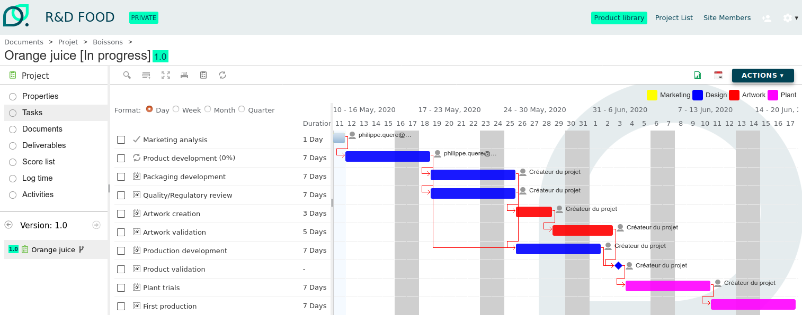

# beCPG PLM – Open Source Product Lifecycle Management

[](https://www.gnu.org/licenses/lgpl-3.0)
[](https://www.oracle.com/java/)
[](https://maven.apache.org/)
[](https://github.com/becpg/becpg-community/issues)
[](https://github.com/becpg/becpg-community/stargazers)
[](https://docs.becpg.fr)
[](http://www.becpg.net)

---

## 🚀 What is beCPG?

**beCPG** is an **open-source PLM (Product Lifecycle Management)** platform built specifically for the **Food, Beverage, and Cosmetics industries**.
It helps companies **launch products faster, reduce compliance risk, and lower IT costs** by centralizing product data, formulation, quality, and regulatory workflows.

👉 [**Request a Live Demo**](https://www.becpg.net/community/) | [**Contact Us**](https://www.becpg.net/contact-us/)

---

## 🌟 Who Uses beCPG?

beCPG is trusted by **innovative SMEs and global manufacturers** in the **Consumer Packaged Goods (CPG)** sector:

* **R\&D teams** use it for formulation, labeling, and innovation tracking.
* **Regulatory & QA** teams manage compliance, complaints, and audits.
* **Marketing & Project teams** plan and launch new products faster.
* **IT teams** integrate it with ERP, CRM, and e-commerce systems.

👥 [**See Customer References**](https://www.becpg.net/who-are-we/customers-references/)

---

## 📸 Screenshots

### Product Repository


*Centralized repository for formulations, packaging, and regulatory data*

### Project Dashboard


*Track new product launches with workflows and Gantt views*

---

## 💡 Business Benefits

* ⏱ **Accelerate Time-to-Market** – Automate formulation, labeling, and approval workflows.
* ✅ **Stay Compliant** – Manage allergens, nutritional values, and regulations across countries.
* 💰 **Reduce Costs** – Open-source licensing, flexible deployment, and low TCO.
* 🌍 **Scale Easily** – Cloud-ready, API-first, and ERP connectors available.
* 🤝 **Choose Your Path** – Start with the free Community Edition, scale with Enterprise Edition support.

---

## ⚙️ Core Features

* **Product Repository (PDM/PIM)** – finished goods, raw materials, packaging, and specs
* **Formulation & Labeling** – allergens, nutritional values, costs, regulatory checks
* **BOM & Document Management** – versioning, variants, packaging, and artwork
* **Change Management & Traceability** – change orders, impact analysis, batch ops
* **Project & Workflow Management** – NPD tracking with boards and Gantt views
* **Quality Management (QMS)** – complaints, audits, control plans
* **Reporting & BI** – product sheets, KPIs, OLAP analysis
* **Integration** – REST API, ERP/CRM connectors (SAP, Odoo, Oracle, etc.)
* **Architecture** – Docker/Kubernetes, microservices-ready, scalable

---

## 🆚 Community vs Enterprise Editions

| Edition                     | Best For                         | Benefits                                                                |
| --------------------------- | -------------------------------- | ----------------------------------------------------------------------- |
| **Community Edition (CE)**  | Innovators, startups, developers | Free & open-source, customizable, try before scaling                    |
| **Enterprise Edition (EE)** | Mid-to-large companies           | Enterprise support, faster deployment, advanced compliance & connectors |

👉 [Download CE](https://sourceforge.net/projects/becpg-community/) | [Compare Editions](https://www.becpg.net/)

---

## 🔍 Why Choose beCPG Over Other PLMs?

| Feature                      | beCPG       | Trace One (Devex) | Aptean (Lascom CPG) | Centric Software | Infor PLM   | 
| ---------------------------- | ----------- | ----------------- | ------------------- | ---------------- | ----------- | 
| **Open Source**              | ✅ Yes       | ❌ No              | ❌ No                | ❌ No             | ❌ No        |      
| **CPG-Specific Features**    | ✅ Yes       | ⚠️ Partial        | ⚠️ Partial          | ⚠️ Partial       | ⚠️ Partial  |   
| **Formulation Engine**       | ✅ Included  | ⚠️ Partial        | ✅ Included          | ⚠️ Partial       | ⚠️ Partial  |
| **Regulatory Compliance**    | ✅ Available | ✅ Available       | ✅ Available         | ✅ Available      | ✅ Available |  
| **Deployment Complexity¹**   | 🟢 Lower    | 🔴 Higher         | 🔴 Higher           | 🔴 Higher        | 🔴 Higher   |
| **Total Cost of Ownership¹** | 🟢 Lower    | 🔴 Higher         | 🔴 Higher           | 🔴 Higher        | 🔴 Higher   |  


¹ Based on publicly available information and customer feedback.

⚠️ Disclaimer :
This comparison is provided for informational purposes, based on publicly available sources and user feedback.
All trademarks and product names are the property of their respective owners.

---

## 📚 Getting Started

1. 📖 [Read Documentation](https://docs.becpg.fr)
2. 🎮 [Try the Live Demo](https://www.becpg.net/community/)
3. ⬇️ [Download Community Edition](https://sourceforge.net/projects/becpg-community/)
4. 🚀 Quick Setup with Docker:

   ```bash
   cp docker-compose.override.yml.sample docker-compose.override.yml
   ./run.sh build_start
   ```

---

<details>
<summary>👨‍💻 Developer Guide (expand)</summary>

### Requirements

* Java 17+
* Maven 3+
* Docker

### Build from Source

```bash
./run.sh build_start
```

### Running Tests

```bash
./run.sh test
mvn test -Dtest=MyTest.java -Dsurefire.failIfNoSpecifiedTests=false
```

### Manual AMP Deployment

#### Install becpg-designer

Install core AMPS

```shell
$>java -jar  $ALF/bin/alfresco-mmt.jar install ./becpg-core/target/becpg-core-$BECPG_VERSION.amp $SERVER/webapps/alfresco.war -force
$>java -jar  $ALF/bin/alfresco-mmt.jar install ./becpg-designer/becpg-designer-core/target/becpg-designer-core-$BECPG_VERSION.amp $SERVER/webapps/alfresco.war -force
```

Install share AMPS

```shell
$>java -jar  $ALF/bin/alfresco-mmt.jar install ./becpg-share/target/becpg-share-$BECPG_VERSION.amp $SERVER/webapps/share.war -force
$>java -jar  $ALF/bin/alfresco-mmt.jar install ./becpg-designer/becpg-designer-share/target/becpg-designer-share-$BECPG_VERSION.amp $SERVER/webapps/share.war -force
```

#### Install becpg-project

Install core AMPS

```shell
$>java -jar  $ALF/bin/alfresco-mmt.jar install ./becpg-core/target/becpg-core-$BECPG_VERSION.amp $SERVER/webapps/alfresco.war -force
$>java -jar  $ALF/bin/alfresco-mmt.jar install ./becpg-project/becpg-project-core/target/becpg-project-core-$BECPG_VERSION.amp $SERVER/webapps/alfresco.war -force
```

Install share AMPS

```shell
$>java -jar  $ALF/bin/alfresco-mmt.jar install ./becpg-share/target/becpg-share-$BECPG_VERSION.amp $SERVER/webapps/share.war -force
$>java -jar  $ALF/bin/alfresco-mmt.jar install ./becpg-project/becpg-project-share/target/becpg-project-share-$BECPG_VERSION.amp $SERVER/webapps/share.war -force
```

#### Install becpg-plm

Install core AMPS

```shell
$>java -jar  $ALF/bin/alfresco-mmt.jar install ./becpg-core/target/becpg-core-$BECPG_VERSION.amp $SERVER/webapps/alfresco.war -force
$>java -jar  $ALF/bin/alfresco-mmt.jar install ./becpg-designer/becpg-designer-core/target/becpg-designer-core-$BECPG_VERSION.amp $SERVER/webapps/alfresco.war -force
$>java -jar  $ALF/bin/alfresco-mmt.jar install ./becpg-project/becpg-project-core/target/becpg-project-core-$BECPG_VERSION.amp $SERVER/webapps/alfresco.war -force
$>java -jar  $ALF/bin/alfresco-mmt.jar install ./becpg-plm/becpg-plm-core/target/becpg-plm-core-$BECPG_VERSION.amp $SERVER/webapps/alfresco.war -force
```

Install share AMPS

```shell
$>java -jar  $ALF/bin/alfresco-mmt.jar install ./becpg-share/target/becpg-share-$BECPG_VERSION.amp $SERVER/webapps/share.war -force
$>java -jar  $ALF/bin/alfresco-mmt.jar install ./becpg-designer/becpg-designer-share/target/becpg-designer-share-$BECPG_VERSION.amp $SERVER/webapps/share.war -force
$>java -jar  $ALF/bin/alfresco-mmt.jar install ./becpg-project/becpg-project-share/target/becpg-project-share-$BECPG_VERSION.amp $SERVER/webapps/share.war -force
$>java -jar  $ALF/bin/alfresco-mmt.jar install ./becpg-plm/becpg-plm-share/target/becpg-plm-share-$BECPG_VERSION.amp $SERVER/webapps/share.war -force
```

</details>

---

## 🤝 Community & Contributing

* [Contributing Guidelines](CONTRIBUTING.md)
* [Code of Conduct](CODE_OF_CONDUCT.md)
* [Security Policy](SECURITY.md)

---

## 📩 Contact

Interested in trying **beCPG PLM**?

* 🌐 [Website](https://www.becpg.net)
* 📖 [Documentation](https://docs.becpg.fr)
* 🎮 [Live Demo](https://www.becpg.net/community/)
* ✉️ [Contact Us](https://www.becpg.net/contact-us/)

---

⚡ **beCPG – Accelerate innovation, stay compliant, and reduce PLM costs for CPG companies.**

---
