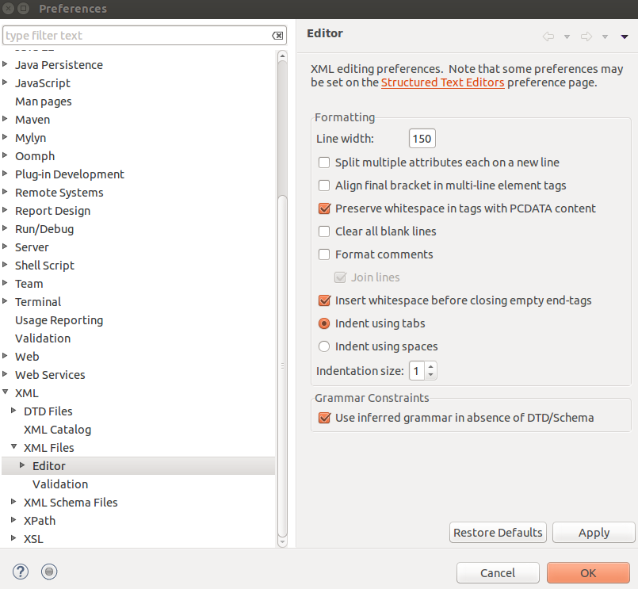
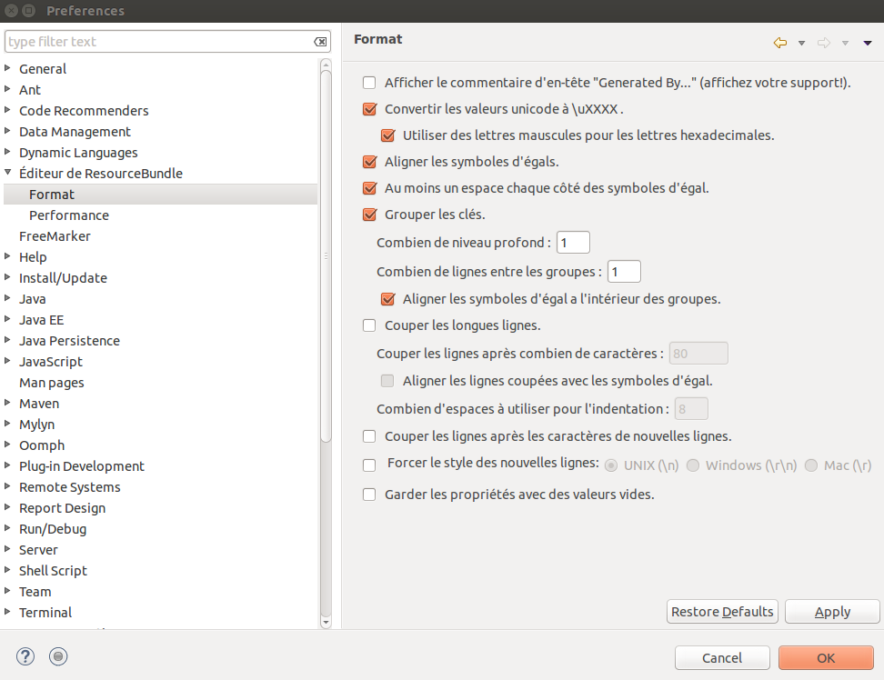

# Source Code Formatting

## Java

Before being committed, a Java class must be cleaned up:

1. Right-click > Source > Clean Up
2. No comments in French, remove Eclipse warnings, no `System.out` or unnecessary logs. Follow the guidelines of SonarLint.

### Configuration Settings

* **Preferences > Java > Code Style > Import :** `becpg_cleanup.xml`
* **Preferences > Java > Formatter > Import :** `becpg_formatter.xml`

### Naming Conventions

Variable and method names should adhere to the conventions outlined in the [Google Java Style Guide - Naming](https://google.github.io/styleguide/javaguide.html#s5-naming).

## XML

Formatting options:

## I18n

## JavaScript

Web -> Client-side JavaScript -> Formatter -> beCPG [built-in]
